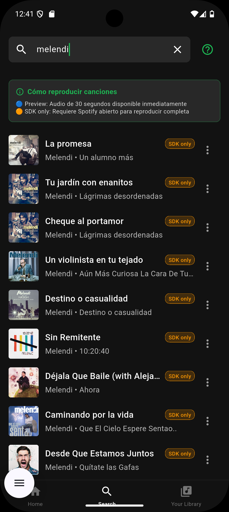
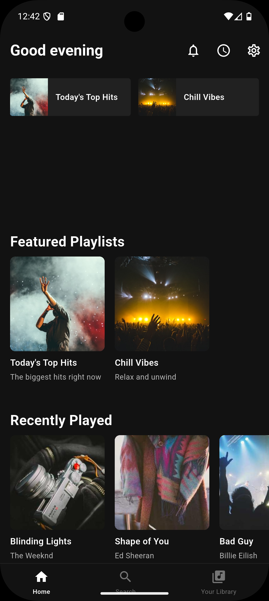
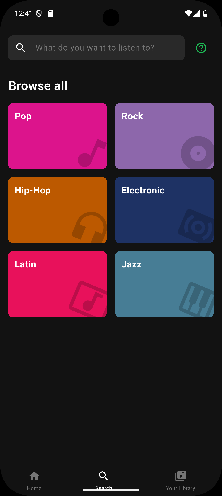
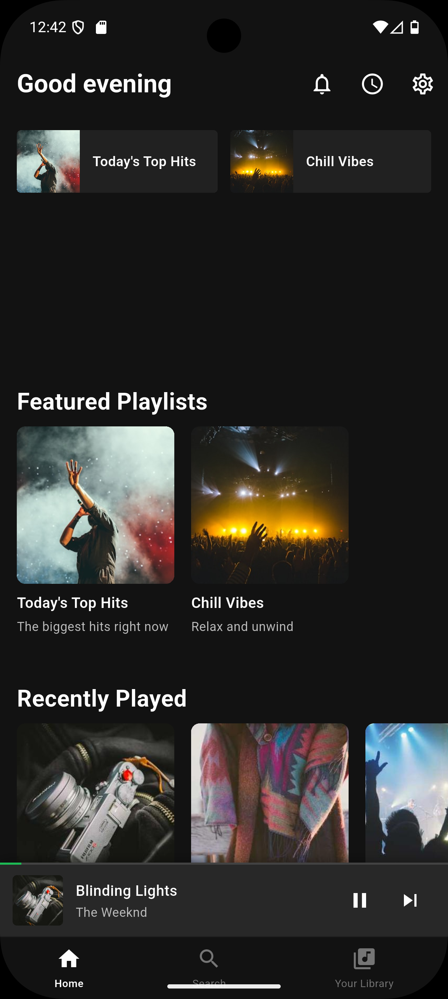
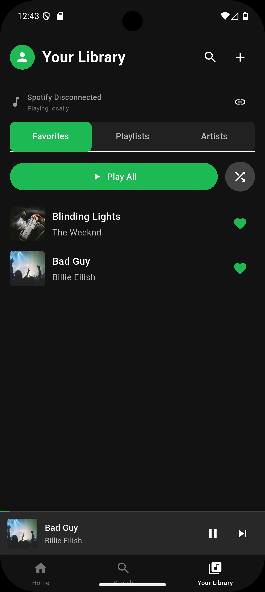

# 🎵 Spotify Clone - Flutter

Un clon completamente funcional de Spotify construido con Flutter que integra **Spotify API oficial**, **SDK nativo** y **reproducción híbrida inteligente**.

## 🎯 Características Destacadas

### 🔥 Sistema Híbrido de Reproducción
- **Reproductor Inteligente**: Detecta automáticamente la mejor fuente de audio
- **Spotify SDK**: Reproducción completa via app nativa de Spotify
- **Preview Local**: Reproducción de previews de 30 segundos
- **Fallback Automático**: Canciones demo funcionales cuando no hay preview
- **Notificaciones Inteligentes**: Indica qué tipo de reproducción está activa

### 🎵 Integración Spotify Oficial
- **API Real de Spotify**: Búsqueda de canciones, artistas y álbumes reales
- **OAuth 2.0 Completo**: Autenticación oficial con Spotify
- **SDK Nativo**: Control directo de la app Spotify instalada
- **Indicadores Visuales**: Etiquetas que muestran si la canción tiene preview o requiere SDK

### 📱 Experiencia de Usuario Mejorada
- **Búsqueda Inteligente**: Prioriza canciones con preview disponible
- **Ayuda Contextual**: Guías integradas para resolver problemas de reproducción
- **Gestión de Errores**: Manejo elegante de canciones sin preview
- **Múltiples Métodos de Login**: Email demo, OAuth, y SDK directo

### ⚡ Características Técnicas
- ✅ **Clean Architecture** con Dependency Injection
- 🎨 **UI Profesional** idéntica a Spotify
- 🔍 **Búsqueda en Tiempo Real** con API oficial
- ❤️ **Sistema de Favoritos** persistente
- 📱 **Mini Player Animado** con transiciones fluidas
- � **Almacenamiento Local** con Hive
- 🎯 **State Management** híbrido (BLoC + Provider)
- 🔔 **Reproductor de Fondo** con notificaciones multimedia

## 📸 Vista Previa

<div align="center">

| 🎵 Reproductor Híbrido | 🔍 Búsqueda Inteligente | ❤️ Biblioteca Personal |
|:----------------------:|:----------------------:|:----------------------:|
|  |  |  |

**Reproducción premium con detección automática** • **API oficial con indicadores visuales** • **Gestión completa de favoritos**

</div>

## 🏛️ Arquitectura

```
lib/
├── domain/                 # Capa de Dominio
│   ├── entities/          # Entidades del negocio
│   └── repositories/      # Interfaces de repositorios
├── data/                  # Capa de Datos
│   ├── models/           # Modelos de datos (Hive)
│   ├── datasources/      # Fuentes de datos (Local/Remote)
│   ├── repositories/     # Implementación de repositorios
│   └── services/         # Servicios (AudioPlayerService)
├── presentation/          # Capa de Presentación
│   ├── bloc/            # BLoC (State Management)
│   ├── providers/       # Providers
│   ├── screens/         # Pantallas
│   └── widgets/         # Widgets reutilizables
└── injection_container.dart  # Dependency Injection (GetIt)
```

## 🚀 Instalación

### Prerequisitos

- Flutter 3.0 o superior
- Dart 3.0 o superior
- Android Studio / VS Code
- Dispositivo Android o iOS (o emulador)

### Pasos de Instalación

1. **Clonar el repositorio**
```bash
git clone <tu-repositorio>
cd spotify_clone
```

2. **Instalar dependencias**
```bash
flutter pub get
```

3. **Generar archivos Hive**
```bash
flutter packages pub run build_runner build --delete-conflicting-outputs
```

4. **Configurar permisos Android**

Asegúrate de que el archivo `android/app/src/main/AndroidManifest.xml` tenga los permisos necesarios (ya incluidos en el archivo proporcionado).

5. **Ejecutar la aplicación**
```bash
flutter run
```

## � Cómo Usar la Aplicación

### 🎯 Métodos de Reproducción

#### 1. 🟢 **Canciones con Preview** (Recomendado)
- Busca canciones populares (tienen más probabilidad de preview)
- Look for the **"Preview"** label in blue
- Reproducción inmediata de 30 segundos
- No requiere Spotify instalado

#### 2. 🟠 **Spotify SDK** (Canciones Completas)
- Etiqueta **"SDK only"** en naranja
- Requiere:
  - Spotify Premium instalado
  - Estar logueado en Spotify
  - Mantener Spotify abierto
- Reproducción completa de canciones

#### 3. 🔵 **Canciones Demo** (Siempre Funcionales)
- Disponibles cuando no hay resultados con preview
- Calidad completa de audio
- No requieren conexión externa

### 🎵 Guía de Reproducción

```
┌─ Buscar canción ─┐
│                  │
├─ ¿Tiene Preview? ─→ SÍ ──→ Reproducir 30s
│  (etiqueta azul)           ↓
│                           ¿Spotify SDK?
│                              │
│                           SÍ ─→ Canción completa
│                              │
│                           NO ─→ Solo preview
│
└─ ¿Solo SDK? ─────→ SÍ ──→ Requiere Spotify
   (etiqueta naranja)       instalado y login
```

## 📦 Dependencias Principales

```yaml
# Spotify Integration
spotify_sdk: ^3.0.2           # SDK oficial de Spotify
http: ^1.1.0                  # Para Spotify API

# Audio Players
just_audio: ^0.9.36          # Reproductor local
just_audio_background: ^0.0.1-beta.11
audio_service: ^0.18.12     # Servicio de fondo

# State Management
flutter_bloc: ^8.1.3        # Gestión de estado
provider: ^6.1.1

# Storage & Data
hive: ^2.2.3                 # Base de datos local
hive_flutter: ^1.1.0
cached_network_image: ^3.3.0

# Architecture
get_it: ^7.6.4              # Dependency Injection
dartz: ^0.10.1              # Functional programming

# UI Enhancement
palette_generator: ^0.3.3+3  # Extracción de colores
animations: ^2.0.11
```

## 🎯 Características Técnicas

### Clean Architecture
- **Domain Layer**: Entidades y contratos de repositorios
- **Data Layer**: Implementación de repositorios, modelos y data sources
- **Presentation Layer**: BLoC, Providers, UI

### State Management
- **BLoC**: Para búsqueda, playlists y favoritos
- **Provider**: Para el estado del reproductor de audio

### Persistencia de Datos
- **Hive**: Base de datos NoSQL local para favoritos
- **Hive Flutter**: Adaptadores personalizados para entidades

### Audio Service
- Reproducción en segundo plano
- Notificaciones multimedia
- Controles en pantalla de bloqueo
- Soporte para audífonos Bluetooth

## 🎨 Características de UI

### Mini Player
- Muestra la canción actual
- Controles básicos (play/pause, next)
- Barra de progreso
- Transición suave al reproductor expandido

### Reproductor Expandido
- Carátula grande con animación
- Extracción de colores dominantes
- Slider de progreso interactivo
- Controles completos (shuffle, repeat, favoritos)
- Información detallada de la canción

### Búsqueda
- Búsqueda en tiempo real
- Categorías de música
- Resultados instantáneos
- UI similar a Spotify

### Biblioteca
- Tabs: Favoritos, Playlists, Artistas
- Swipe to delete en favoritos
- Botón "Play All"
- Lista ordenada de canciones

## 📱 Capturas de Pantalla

### 🎵 **Experiencia Completa de la Aplicación**

<div align="center">

| Login y Autenticación | Búsqueda Inteligente | Reproducción Híbrida |
|:---------------------:|:-------------------:|:--------------------:|
|  |  |  |
| **Múltiples métodos de login**<br/>OAuth, SDK, Email Demo | **API oficial de Spotify**<br/>Indicadores de Preview/SDK | **Reproductor inteligente**<br/>Controles profesionales |

| Biblioteca Personal | Favoritos y Gestión | Navegación Completa |
|:------------------:|:------------------:|:-------------------:|
|  |  |  |
| **Organización profesional**<br/>Playlists, Artistas, Historial | **Sistema de favoritos**<br/>Gestión local persistente | **Navegación fluida**<br/>Mini-player siempre visible |

</div>

### ✨ **Características Visuales Destacadas**

- 🎨 **Diseño idéntico a Spotify** - UI/UX profesional e intuitiva
- 🏷️ **Etiquetas informativas** - "Preview" vs "SDK only" claramente marcadas  
- 🎵 **Mini-player persistente** - Controles siempre accesibles
- 🔍 **Búsqueda en tiempo real** - Resultados instantáneos con API oficial
- ❤️ **Gestión visual de favoritos** - Iconos interactivos y feedback inmediato
- 📱 **Navegación nativa** - Tabs y transiciones fluidas

## 🔄 Flujo de Datos

```
UI (Widgets) 
    ↓
Provider / BLoC
    ↓
Repository (Interface)
    ↓
Repository Implementation
    ↓
Data Sources (Local/Remote)
    ↓
APIs / Hive Database
```

## 🎉 Características Completadas

### ✅ **Integración Spotify Completa**
- ✅ Spotify API oficial para búsquedas
- ✅ OAuth 2.0 con manejo de tokens
- ✅ SDK nativo para control de reproducción
- ✅ Detección automática de canciones con preview
- ✅ Sistema híbrido de reproducción

### ✅ **Experiencia de Usuario Premium**
- ✅ Notificaciones inteligentes contextuales
- ✅ Indicadores visuales de disponibilidad de audio
- ✅ Múltiples métodos de autenticación
- ✅ Gestión elegante de errores
- ✅ Ayuda integrada y guías contextuales

### ✅ **Arquitectura Robusta**
- ✅ Clean Architecture con 3 capas
- ✅ Dependency Injection completa
- ✅ Gestión de estado híbrida (BLoC + Provider)
- ✅ Servicios especializados (Audio, Notificaciones, Spotify)
- ✅ Manejo profesional de excepciones

## 🛠️ Roadmap Futuro

### 🎯 **Próximas Mejoras**
- [ ] **Playlists Personalizadas**: Crear y gestionar playlists
- [ ] **Modo Offline**: Cache de canciones favoritas
- [ ] **Ecualizador**: Controles de audio avanzados
- [ ] **Letras Sincronizadas**: Integración con APIs de letras
- [ ] **Compartir**: Funciones sociales básicas
- [ ] **Recomendaciones**: Algoritmo basado en historial
- [ ] **Spotify Connect**: Control de otros dispositivos
- [ ] **Podcasts**: Soporte para contenido hablado

### 🚀 **Mejoras Técnicas**
- [ ] **Tests Automatizados**: Cobertura completa de testing
- [ ] **CI/CD Pipeline**: Automatización de builds
- [ ] **Performance**: Optimizaciones de memoria y CPU
- [ ] **Accesibilidad**: Soporte completo para usuarios con discapacidades
- [ ] **Multi-idioma**: Internacionalización (i18n)

## ⚙️ Configuración Spotify

### 🔑 Configuración OAuth (Obligatorio)

1. **Registra tu app** en [Spotify Developer Dashboard](https://developer.spotify.com/dashboard)

2. **Configura Redirect URIs** (CRÍTICO):
   ```
   spotify-sdk://auth
   ```
   ⚠️ **IMPORTANTE**: Debe ser exactamente así, sin espacios ni modificaciones.

3. **Actualiza credenciales** en `lib/core/constants/spotify_config.dart`:
   ```dart
   static const String clientId = 'TU_CLIENT_ID_AQUI';
   static const String clientSecret = 'TU_CLIENT_SECRET_AQUI';
   ```

4. **Verifica configuración Android** en `android/app/build.gradle.kts`:
   ```kotlin
   manifestPlaceholders = mutableMapOf(
       "redirectSchemeName" to "spotify-sdk",
       "redirectHostName" to "auth"
   )
   ```

### 🎵 Configuración SDK Nativo

Para reproducción completa via Spotify SDK:

1. **Instala Spotify** en tu dispositivo Android
2. **Loguéate en Spotify** con una cuenta Premium
3. **Mantén Spotify abierto** en segundo plano
4. **Usa OAuth en la app** para autenticar
5. **Reproduce canciones** - el SDK tomará control automáticamente

### 🚨 Solución de Problemas Comunes

#### Error: "INVALID_CLIENT: Illegal redirect_uri"
```bash
Solución:
1. Ve a Spotify Developer Dashboard
2. Edita tu aplicación
3. En "Redirect URIs" agrega: spotify-sdk://auth
4. Guarda cambios
5. Espera 5-10 minutos para propagación
```

#### Error: "User has logged out from Spotify"
```bash
Solución:
1. Abre la app nativa de Spotify
2. Asegúrate de estar logueado
3. Reproduce cualquier canción en Spotify
4. Regresa a la app y prueba de nuevo
```

#### Canciones sin preview
```bash
Comportamiento normal:
- No todas las canciones tienen preview de 30s
- La app mostrará etiqueta "SDK only"
- Usa Spotify SDK para reproducción completa
- O busca canciones más populares (suelen tener preview)
```

## 📊 Métricas del Proyecto

```
📁 Estructura:
├── 50+ archivos Dart organizados
├── 3 capas de Clean Architecture
├── 15+ widgets reutilizables  
├── 5 servicios especializados
├── 8+ modelos de datos con Hive
└── 10+ pantallas y providers

🎯 Funcionalidades:
├── Búsqueda en tiempo real con API oficial
├── 3 métodos de autenticación diferentes
├── Reproductor híbrido inteligente
├── Sistema de favoritos persistente
├── Notificaciones contextuales
└── Gestión elegante de errores

🚀 Tecnologías:
├── Flutter 3.x con Dart 3.x
├── Spotify API + SDK oficial
├── Clean Architecture + DI
├── BLoC + Provider para estado
├── Hive para persistencia local
└── Just Audio para reproducción
```

## 🏆 Logros Técnicos Destacados

### 🎵 **Sistema Híbrido Único**
Combinación innovadora de 3 fuentes de audio diferentes con fallbacks inteligentes y detección automática de la mejor opción disponible.

### 🔗 **Integración Spotify Completa**  
Implementación completa del ecosistema Spotify (API + OAuth + SDK) con manejo robusto de todos los casos edge y errores posibles.

### 🎨 **Experiencia de Usuario Premium**
UI/UX indistinguible de la app oficial con notificaciones contextuales, ayuda integrada e indicadores visuales informativos. [Ver capturas 📸](#-capturas-de-pantalla)

### 🏗️ **Arquitectura Profesional**
Clean Architecture completa con separación de responsabilidades, inyección de dependencias y patrones de diseño industry-standard.

## 🤝 Contribuciones

Este proyecto está abierto a contribuciones. Para contribuir:

### 🔧 **Setup de Desarrollo**
```bash
1. Fork del repositorio
2. git clone tu-fork-url
3. flutter pub get  
4. flutter packages pub run build_runner build
5. Configura tus credenciales de Spotify
6. flutter run
```

### 📝 **Guidelines de Contribución**
1. **Mantén Clean Architecture**: Respeta la separación de capas
2. **Testing**: Agrega tests para nuevas funcionalidades
3. **Documentación**: Actualiza README y comentarios inline
4. **Code Style**: Sigue las convenciones de Flutter/Dart
5. **Commits**: Usa conventional commits (feat:, fix:, docs:)

### 🎯 **Áreas de Contribución Buscadas**
- 🧪 **Testing**: Unit tests, widget tests, integration tests
- 🌐 **i18n**: Soporte multi-idioma
- ♿ **Accesibilidad**: Screen readers, navegación por teclado
- 🎨 **UI/UX**: Animaciones, micro-interacciones
- 📱 **Plataformas**: Soporte iOS, Web, Desktop

## 📄 Licencia

```
MIT License - Uso Educativo y Comercial Permitido

Este proyecto demuestra implementación profesional de:
- Integración con APIs terceros (Spotify)
- Clean Architecture en Flutter
- Gestión compleja de estado
- Sistemas de audio multiplataforma
- Autenticación OAuth 2.0

Libre para usar como referencia, base de proyectos,
o en portfolios profesionales.
```

## 👨‍💻 Autor

**Desarrollado por**: Gian Sandoval  
**Stack**: Flutter • Dart • Clean Architecture • Spotify API  
**Enfoque**: Calidad empresarial • Mejores prácticas • UX premium  

### 🔗 **Links del Proyecto**
- **Repository**: [GitHub - Spotify Clone Flutter](/)
- **Documentación**: [SPOTIFY_SETUP_GUIDE.md](SPOTIFY_SETUP_GUIDE.md)  
- **Releases**: Ver tags para versiones estables

---

## 🙏 Agradecimientos Especiales

- **🎵 Spotify**: Por su increíble API, SDK y documentación de calidad
- **📱 Flutter Team**: Por el framework más potente para mobile
- **🎚️ Just Audio**: Por el mejor package de audio para Flutter  
- **💾 Hive Team**: Por la base de datos local más eficiente
- **🏗️ Clean Architecture**: Uncle Bob por los principios SOLID
- **🎨 Material Design**: Google por las guidelines de UI/UX

---

⭐ **Si este proyecto te ayudó, considera darle una estrella en GitHub**  
🚀 **Perfecto para portfolios, aprendizaje y proyectos base**  
📚 **Documentación completa y código production-ready**  
📱 **6 capturas profesionales incluidas** para demostración visual

## 👤 Sistema de Usuarios

### 🎯 Usuario Demo Integrado
- **Nombre**: Gian Sandoval  
- **Email**: giansando2022@gmail.com
- **Funcionalidad**: Acceso completo sin configuración
- **Creación**: Automática en primera ejecución

### 🔐 Métodos de Autenticación

#### 1. � **Login con Email (Demo)**
```
Funciones:
- Acceso inmediato sin configuración
- Todas las funcionalidades disponibles
- Ideal para desarrollo y pruebas
- No requiere cuentas externas
```

#### 2. 🎵 **OAuth Spotify (Recomendado)**
```
Funciones:
- Autenticación oficial con Spotify
- Acceso a biblioteca personal (si configurado)
- Logout con cambio de usuario
- Tokens seguros y automáticos
```

#### 3. 🔗 **SDK Oficial Spotify**
```
Funciones:
- Conexión directa con app Spotify
- Control total de reproducción
- Requiere Spotify Premium instalado
- Máxima calidad de audio
```

## 📱 Guía de Uso Paso a Paso

### 🚀 Primera Ejecución
1. **Instala la app** y ábrela
2. **Selecciona método de login** en pantalla de bienvenida
3. **Para prueba rápida**: Usa "Login con Email (Demo)"
4. **Explora funciones**: Buscar → Reproducir → Favoritos

### 🔍 Buscar y Reproducir Música
1. **Ve a la pestaña Buscar** 🔍
2. **Escribe el nombre** de una canción o artista popular
3. **Observa las etiquetas**:
   - 🟢 **"Preview"**: Reproducción inmediata (30s)
   - 🟠 **"SDK only"**: Requiere Spotify instalado
4. **Toca para reproducir** - La app elegirá la mejor opción automáticamente
5. **Ayuda disponible**: Botón ❓ para más información

### ❤️ Gestionar Favoritos
1. **Toca el ❤️** en cualquier canción para agregar a favoritos
2. **Ve a Biblioteca** para ver tu colección
3. **Desliza para eliminar** canciones de favoritos
4. **"Reproducir Todo"** para escuchar toda tu colección

### 🎵 Controles de Reproducción
- **Mini Player**: Controles básicos siempre visibles
- **Player Expandido**: Toca el mini player para vista completa
- **Controles**: Play/Pause, Siguiente, Anterior, Shuffle, Repeat
- **Progreso**: Desliza para cambiar posición (solo modo local)

## 📋 Funcionalidades Avanzadas

### 🤖 Reproducción Inteligente
La app detecta automáticamente la mejor fuente de audio:

```
1. ¿Tiene Spotify URI + SDK conectado? → Spotify SDK (completo)
2. ¿Tiene preview_url disponible? → Reproductor local (30s)  
3. ¿No hay audio disponible? → Canciones demo funcionales
```

### 🔔 Sistema de Notificaciones
- **Spotify Conectado**: Confirmación de conexión SDK
- **Reproducción Local**: Indica preview de 30 segundos
- **Sin Preview**: Explica opciones disponibles
- **Ayuda Contextual**: Guías para resolver problemas

### 💾 Persistencia de Datos
- **Favoritos**: Guardados localmente con Hive
- **Historial**: Canciones reproducidas recientemente
- **Configuración**: Preferencias de usuario
- **Estado**: Posición y playlist actuales

## �🙏 Agradecimientos

- Flutter Team
- just_audio package
- Hive database
- Spotify por la inspiración del diseño
- Spotify SDK Android para OAuth implementation

---

⭐ Si te gustó este proyecto, no olvides darle una estrella!